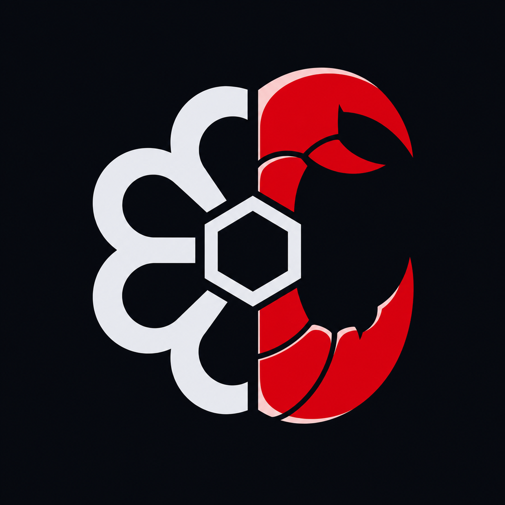

**English** | [한국어](README.ko.md) | [中文](README.zh.md)

<p align="center">
  
</p>

<h1 align="center">lidgeclaw</h1>

<p align="center">
  
  
  
  
  
  
  
  <a href="LICENSE"></a>
</p>

<p align="center">
  One repo, three runtimes: <strong>cursorclaw</strong> (Cursor) + <strong>zclaw</strong> (ZCode) + <strong>claudeclaw</strong> (Claude Code).<br>
  Shared skills and cli-jaw-style discipline, forked from
  <a href="https://github.com/lidge-jun/codexclaw">codexclaw</a>.
</p>

---

**lidgeclaw** is the umbrella for:

| Plugin | Runtime | Path |
| --- | --- | --- |
| **cursorclaw** | Cursor | `plugins/cursorclaw/` |
| **zclaw** | ZCode | `plugins/zclaw/` |
| **claudeclaw** | Claude Code | `plugins/claudeclaw/` |

**Common layer** SoT is `plugins/shared/` (skills, shareable agent `.md`, commands) plus `.codexclaw/` state. Host plugins symlink that tree. **Host-unique**: manifests and hook bridges; Codex `.toml` agents stay on cursorclaw; compiled components stay in `plugins/cursorclaw/components/`. Full table: [PORTING.md](PORTING.md). Workflow inspiration remains [OMO / oh-my-openagent](https://github.com/code-yeongyu/oh-my-openagent). Credits: [NOTICE.md](NOTICE.md).

## Install

### Cursor (cursorclaw)

```bash
./scripts/global-install.sh --target cursor
# or: ./scripts/global-install.sh   # default installs cursor + zcode + claude
```

Installs plugin → `~/.cursor/plugins/local/cursorclaw`, skills, hooks, rule, and `crc` / `cursorclaw` / `lidgeclaw` CLI. Restart the Cursor agent session.

### ZCode (zclaw)

```bash
./scripts/global-install.sh --target zcode
```

Registers this checkout as a local ZCode marketplace and stages `zclaw`. In ZCode you can also **Settings → Plugins → Create → Add marketplace** → this repo, then install **zclaw**. Restart the ZCode session.

### Claude Code (claudeclaw)

```bash
./scripts/global-install.sh --target claude
```

Adds this checkout as a local Claude marketplace and runs `claude plugin install claudeclaw@lidgeclaw`. Restart the Claude Code session. Do not also copy plugin skills into `~/.claude/skills/`.

Check status: `./scripts/global-install.sh --status`.

## Layout

```text
.cursor-plugin/marketplace.json   # Cursor marketplace (cursorclaw)
.zcode-plugin/marketplace.json    # ZCode marketplace (zclaw)
.claude-plugin/marketplace.json   # Claude marketplace (claudeclaw)
plugins/shared/                   # skills + shareable agents/commands
plugins/cursorclaw/               # Cursor host shell
plugins/zclaw/                    # ZCode host shell
plugins/claudeclaw/               # Claude Code host shell
bin/cursorclaw.mjs                # crc / cursorclaw / lidgeclaw entry
PORTING.md
UPSTREAM.lock
```

## CLI

```bash
lidgeclaw status   # aliases: crc, cursorclaw, lc
crc doctor
```

## Development

```bash
npm run build
npm run gate
npm test
```

Cursor hook parity: [PORTING.md](PORTING.md). ZCode hooks start at SessionStart — see [plugins/zclaw/README.md](plugins/zclaw/README.md).

## License

MIT — see [LICENSE](LICENSE).
