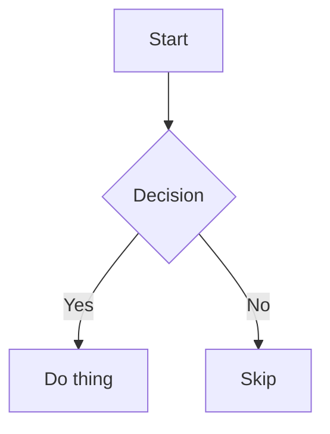

# wp3 — exact change plan

Dependency: wp2 domain contracts.

Scope: only the files and changes below. Re-read against the current tree at P; amend before writing if stale. Existing audit is historical evidence and is not rewritten.

Verification: `node --test plugins/codexclaw/test/manifest-policy.test.mjs` (baseline 6/6 pass, reads skill metadata); YAML parsing over changed SKILL.md files; `git diff --check`. New focused visualize inspection test runs missing-cache, version ordering, explicit-root, drift and malformed-tracker scenarios without touching the real cache.

## 1. MODIFY plugins/codexclaw/skills/dev-diagram-viewer/SKILL.md

Before:

`````text
---
name: cxc-dev-diagram-viewer
description: "MUST USE when producing or displaying diagrams, charts, visualizations, SVG, mermaid, or interactive widgets in any Codex surface. Detects the runtime environment (Codex Desktop app vs CLI) and routes diagram output to the correct rendering path — native inline for supported formats, browser-based rendering for everything else. On-demand: activates by description match or explicit mention. Triggers: diagram, chart, SVG, mermaid, visualization, visualize, flowchart, sequence diagram, ER diagram, architecture diagram, Chart.js, ECharts, D3, Leaflet, map, interactive, widget, 다이어그램, 차트, 시각화, 그려줘, 플로우차트."
metadata:
  last-verified: "2026-07-11"
  short-description: "Environment-aware diagram rendering: native pass-through or browser-based display."
  keywords: [diagram, chart, SVG, mermaid, visualization, browser, rendering, interactive, widget]
---

# Dev-Diagram-Viewer — Environment-Aware Diagram Rendering

Route diagram, chart, and visualization output to the correct rendering surface
based on the detected runtime environment. This skill is on-demand: it activates
by description match or explicit `$cxc-dev-diagram-viewer` mention.

> **C0/C1 work (small local patches):** See `dev` §0.0 Work Classifier + §0.1 Patch Fast-Path before reading references.

> **`dev` is canonical:** `dev` §0.2 Rule Classes, §3 Verification Gate, and §5 Safety Rules apply to all work governed by this skill.

## Reference Files

- `reference/environment-detection.md` — environment detection signals and decision tree
- `reference/html-templates.md` — HTML wrapper templates for all diagram types
- `reference/visualize-contract.md` — embedded Codex Desktop inline visualization contract

## Why This Skill Exists

Different Codex surfaces support different rendering capabilities:

| Surface | Mermaid | Inline SVG | HTML Widgets | Chart.js/ECharts | Interactive |
|---------|---------|------------|--------------|------------------|-------------|
| Codex Desktop app | native | fragment only | inline-vis subset | inline-vis subset | inline-vis subset |
| CLI (jaw Web UI) | native | native | native | native | native |
| CLI (terminal) | ASCII fallback | no | no | no | no |

When the agent produces a diagram type that the current surface cannot render
natively or through Desktop inline-vis, this skill wraps the content in a
self-contained HTML file and opens it in a browser — making every diagram type
work everywhere.

## Environment Detection (read first)

Detect the runtime environment before choosing the delivery path. Use these
signals in priority order:

### Signal 1: Environment Variable (most reliable)

```bash
echo $CODEX_INTERNAL_ORIGINATOR_OVERRIDE
```

| Value | Environment |
|-------|-------------|
| `Codex Desktop` | Codex Desktop app (Electron) |
| absent or other | CLI environment |

### Signal 2: System Prompt Context (implicit)

The Codex Desktop app injects an `<app-context>` block into the system prompt
containing `# Codex desktop context`. This block includes directives for image
rendering, mermaid support, `::code-comment`, and `::git-*` directives. Its
presence confirms the Desktop app environment.

The system prompt also states:
> Use mermaid diagrams to represent complex diagrams, graphs, or workflows.

This confirms mermaid is natively rendered in the app.

### Signal 3: Supplementary Checks

| Signal | Desktop app | CLI |
|--------|-------------|-----|
| `__CFBundleIdentifier` | `com.openai.codex` | absent |
| `TERM` | `dumb` | `xterm-256color` etc. |
| `PATH` contains `ChatGPT.app` | yes | no |
| Browser plugin available | `browser:control-in-app-browser` listed | not listed |

For full detection logic, see `reference/environment-detection.md`.

## Routing Table

After detecting the environment, route each diagram type:

### Codex Desktop App

| Diagram Type | Delivery | Method |
|---|---|---|
| Mermaid (any type) | **Native pass-through** | Output ` ```mermaid ` code block directly in response |
| Standard chart / comparison / interactive explainer / data-driven visual covered by the visualize contract | **Inline visualization** | Follow `reference/visualize-contract.md`, write an HTML fragment to `.codex/visualizations/YYYY/MM/DD/<thread-id>/`, and output `::codex-inline-vis{file="<title>.html"}` |
| Inline SVG | **Browser render** | Wrap standalone structural SVG in HTML, open in browser |
| Chart.js / ECharts / D3 (when full-page is needed) | **Browser render** | Wrap in HTML with CDN, open in browser |
| Leaflet map | **Browser render** | Wrap in HTML with CDN, open in browser |
| Three.js / p5.js / Matter.js | **Browser render** | Wrap in HTML with CDN, open in browser |
| Interactive widget (sliders etc.; full-page or contract-unsupported) | **Browser render** | Wrap in HTML, open in browser |
| jaw `diagram-html` / `diagram-file` | **Browser render** | Extract HTML content, wrap, open in browser |

Inline-vis is the primary Desktop path for standard charts, comparisons, and
interactive explainers. Browser render remains the fallback for 3D, audio,
physics, full-page, and other contract-unsupported needs.

### CLI Environment

| Diagram Type | Delivery | Method |
|---|---|---|
| All types | **Browser render** | Wrap in HTML, open with `open` (macOS), `xdg-open` (Linux), or `start ""` (Windows) |

> In CLI with jaw Web UI running, the native jaw renderer handles everything.
> This skill activates in CLI only when jaw Web UI is not the active surface
> (e.g., direct Codex CLI, plain terminal).

## Delivery Workflow

### Step 1: Generate the Diagram Content

Produce the diagram source as you normally would — mermaid syntax, raw SVG
markup, Chart.js JavaScript, etc. For Mermaid in Codex Desktop, output it
directly and stop (native rendering handles it). For a Desktop visualization
covered by the inline contract, follow the Inline Visualization section below.

### Step 2: Wrap in HTML (when browser render is needed)

Save a self-contained HTML file to the system temp directory. Use the system
temp directory (e.g., `os.tmpdir()` in Node, or `$TMPDIR`/`%TEMP%` in shell)
instead of hardcoding `/tmp/`:

```bash
# Platform-neutral temp path
<system-temp>/codex-diagrams/<session-id>-<diagram-id>.html

# Create the directory with the platform-appropriate command or API
<create-directory> <system-temp>/codex-diagrams
```

Use the templates in `reference/html-templates.md` to wrap the content.
Every HTML file must be:
- **Self-contained**: all dependencies loaded via CDN
- **Theme-aware**: dark mode by default, light mode toggle available
- **Responsive**: works on any viewport
- **Zero-config**: opens and renders with no server needed

### Step 3: Open in Browser

#### Primary Method (All Environments on macOS)

Open the generated file in the system's default browser. This works from both
Codex Desktop and CLI environments on macOS:

```bash
open <system-temp>/codex-diagrams/<filename>.html
```

On Linux, use the platform equivalent:

```bash
xdg-open <system-temp>/codex-diagrams/<filename>.html
```

On Windows, use:

```cmd
start "" <system-temp>\codex-diagrams\<filename>.html
```

#### Enhancement (Codex Desktop Only)

Optionally use the Browser plugin to capture screenshots for an inline preview.
The in-app browser rejects `file://` URLs, so first serve the output directory
over local HTTP:

```bash
cd <system-temp>/codex-diagrams
python3 -m http.server 8765
```

Then navigate to `http://127.0.0.1:8765/<filename>.html`. Do not assume tab
creation or navigation method names: select the Browser plugin binding, read the
complete API returned by `browser.documentation()`, and use the operations
documented for that binding. The same rule applies to taking screenshots for
inline preview.


### Step 4: Notify the User

After opening the diagram in the browser, inform the user:

- Mention that the diagram is open in the browser
- Provide the absolute file path as a clickable link: `[diagram.html](<system-temp>/codex-diagrams/<filename>.html)`
- If in Codex Desktop with in-app browser, mention it opened in the side panel

## Diagram Type Detection

When producing output, classify the diagram type to choose the correct route:

| Content Pattern | Type | Route (Desktop) |
|---|---|---|
| ` ```mermaid ` fence | Mermaid | Native |
| `<svg` tag or SVG markup | Inline SVG | Browser |
| `new Chart(` or Chart.js patterns | Chart.js | Inline-vis |
| `echarts.init` or ECharts patterns | ECharts | Inline-vis |
| `L.map(` or Leaflet patterns | Leaflet map | Browser |
| `new THREE.` or Three.js patterns | Three.js 3D | Browser |
| `new p5(` or p5.js patterns | p5.js creative | Browser |
| `Matter.Engine` or Matter.js patterns | Physics sim | Browser |
| `d3.select` or D3 patterns | D3 visualization | Inline-vis when standard; Browser when full-page |
| `Tone.` or Tone.js patterns | Audio viz | Browser |
| ` ```diagram-html ` fence | jaw widget | Browser |
| ` ```diagram-file ` fence | jaw file widget | Browser |

## HTML Generation Rules

When wrapping diagram content in HTML:

1. **Dark theme by default** — use `background: #0f172a; color: #e2e8f0`
2. **CDN sources** — load libraries from `cdn.jsdelivr.net` or `cdnjs.cloudflare.com`
3. **Error handling** — add `onerror` fallbacks for CDN loads
4. **Viewport meta** — include `<meta name="viewport" content="width=device-width, initial-scale=1">`
5. **Charset** — always `<meta charset="utf-8">`
6. **No external images** — embed everything inline
7. **Title** — set `<title>` to describe the diagram content

### CDN Library Reference

| Library | CDN URL | Version |
|---|---|---|
| Mermaid | `https://cdn.jsdelivr.net/npm/mermaid@11/dist/mermaid.esm.min.mjs` | 11.x |
| Chart.js | `https://cdn.jsdelivr.net/npm/chart.js@4/dist/chart.umd.min.js` | 4.x |
| ECharts | `https://cdn.jsdelivr.net/npm/echarts@6/dist/echarts.min.js` | 6.x |
| D3 | `https://cdn.jsdelivr.net/npm/d3@7/dist/d3.min.js` | 7.x |
| Three.js | `https://cdn.jsdelivr.net/npm/three@0.185/build/three.module.min.js` | 0.185.x |
| Leaflet CSS | `https://cdn.jsdelivr.net/npm/leaflet@1/dist/leaflet.min.css` | 1.x |
| Leaflet JS | `https://cdn.jsdelivr.net/npm/leaflet@1/dist/leaflet.min.js` | 1.x |
| p5.js | `https://cdn.jsdelivr.net/npm/p5@2/lib/p5.min.js` | 2.x |
| Matter.js | `https://cdn.jsdelivr.net/npm/matter-js@0.20/build/matter.min.js` | 0.20.x |
| Tone.js | `https://cdn.jsdelivr.net/npm/tone@15/build/Tone.js` | 15.x |

> Pin to major versions for stability. See `reference/html-templates.md` for
> complete wrapper templates per library.

## Mermaid Native Pass-Through (Codex Desktop)

When in Codex Desktop, output mermaid directly — no wrapping needed:

````

````

Mermaid 11.16 stable types work natively:
`flowchart`, `sequenceDiagram`, `classDiagram`, `stateDiagram-v2`,
`erDiagram`, `gantt`, `pie`, `mindmap`, `timeline`, `journey`,
`gitGraph`, `quadrantChart`, `block`, `kanban`, `packet`, `sankey`,
`xychart`, `ishikawa`, `requirementDiagram`, `zenuml`.

Beta types require their suffix:
`radar-beta`, `architecture-beta`, `treemap-beta`, `venn-beta`,
`wardley-beta`, `treeView-beta`, `cynefin-beta`, `swimlane-beta`.

Do NOT use `C4Context`, `C4Container` etc. — dark mode text is unreadable
(mermaid #4906). Substitute with `flowchart` + subgraphs or structural SVG
via browser render.

## Inline Visualization (Codex Desktop)

When Codex Desktop is detected and the visualization is a standard chart,
comparison, interactive explainer, or data-driven visual, use the inline-vis
contract. See `reference/visualize-contract.md` for the complete fragment
format, CSS variables, utility classes, and composition rules.

Write an HTML fragment with no doctype to the thread-scoped visualization
directory `.codex/visualizations/YYYY/MM/DD/<thread-id>/`, then emit
`::codex-inline-vis{file="<title>.html"}`. This path follows the locally embedded
contract directly and does not require loading the bundled `visualize` skill.
Use browser render as before for 3D, audio, physics, full-page interactive, and
other types the inline-vis contract does not cover.

## Responsive Diagram Layout (DIAGRAM-LAYOUT-01, STRICT)

- Use Mermaid for static structures that can be expressed as labeled nodes and
  edges.
- For custom HTML diagrams, place text-bearing nodes in normal document flow
  using semantic HTML and CSS Grid or Flexbox. Use `gap`, wrapping, stacking,
  intrinsic sizing, `min-width: 0`, and text wrapping.
- Do not position text-bearing nodes with hand-calculated SVG `x`/`y`,
  `transform`, absolute `top`/`left`, or fixed node widths/heights.
- SVG or canvas may render chart marks or a connector overlay, but must not be
  the layout authority for HTML nodes.
- If connectors use SVG, derive their endpoints from rendered DOM bounds and
  recompute them with `ResizeObserver` after layout, font, content, or viewport
  changes.
- Verify the longest-label state at approximately 736px and 320px. Fail
  verification if nodes or labels intersect, content clips, or horizontal
  overflow appears.

## Combined Output Pattern

When a response includes both text explanation and a browser-rendered
non-mermaid diagram:

1. Write the text explanation in the response
2. Generate and save the HTML file
3. Open it in the browser
4. Reference the diagram with a file link in the response

Example flow:
```
Agent response text explaining the architecture...

[Architecture diagram](<system-temp>/codex-diagrams/arch-001.html) (opened in browser)
```

Do NOT put SVG markup or HTML widget code directly in the Codex Desktop
response — it will not render. Route supported visualizations through inline-vis
and unsupported or full-page output through the browser path.

## Screenshot Capture (optional enhancement)

After opening a diagram through local HTTP in the in-app browser, optionally
capture a screenshot and embed it in the response for inline visibility. Read
the complete `browser.documentation()` output first and use the screenshot API
documented by the selected browser binding.

This gives the user both:
- An inline preview in the chat (screenshot image)
- An interactive version in the browser (full HTML)

Use this when the diagram has important detail that benefits from being
visible directly in the conversation.

## Interaction with Other Skills

### `cxc-dev` (parent router)
This skill is a leaf under the `dev` family. It follows `dev` §0.0 work
classification. Mermaid native pass-through is C0 because it emits only a code
fence with no executable content. Diagram rendering that produces executable
HTML, including Chart.js, ECharts, and interactive widgets, is C1. Browser-rendered
content with CDN scripts is also C1: it is a single-file local behavior change,
but the output is executable.

### `diagram` skill (cli-jaw)
When the cli-jaw `diagram` skill is active (jaw Web UI context), defer to it
entirely — it has native rendering for all types. This skill activates only
when jaw's native renderer is not available (Codex Desktop, plain CLI terminal).

### `browser:control-in-app-browser`
This skill can optionally use the Browser plugin for HTTP-served local HTML and
screenshot capture in Codex Desktop. Follow the Browser skill's bootstrap and
documented tab-management patterns. Do not re-initialize if a browser binding
already exists.

### `visualize` skill (Codex bundled)
The visualize contract is embedded locally as `reference/visualize-contract.md`.
This router follows that contract directly without invoking the bundled skill.
Upstream drift is tracked with `upstream/sync-check.sh`.

## When NOT to Use

- Plain text answers (no visual needed)
- Code review / debugging (code blocks are clearer)
- Mermaid in Codex Desktop (native — just output the fence)
- jaw Web UI is the active surface (jaw handles rendering natively)
- User explicitly asks for text-only explanation

## Quick Reference

```
Environment?
  |
  +-- Codex Desktop
  |     |
  |     +-- Mermaid? --> Output ```mermaid fence (native)
  |     |
  |     +-- Standard chart/comparison/interactive? --> Inline-vis (reference/visualize-contract.md)
  |     |     --> Write fragment to .codex/visualizations/... → ::codex-inline-vis
  |     |
  |     +-- 3D / audio / physics / full-page? --> HTML file --> Browser
  |     |
  |     +-- Anything else (SVG, Leaflet, other)? --> HTML file --> Browser
  |           |
  |           +-- Primary --> open command
  |           +-- Optional inline preview? --> Local HTTP + Browser plugin
  |
  +-- CLI
        |
        +-- jaw Web UI active? --> Defer to jaw diagram skill
        |
        +-- No jaw? --> HTML file --> open command
```

## Upstream Tracking

The embedded contract tracks `visualize` v1.0.11. Run
`upstream/sync-check.sh` to detect upstream drift, and see
`upstream/visualize-upstream.md` for the synchronization history.

## Render Verification (DIAGRAM-RENDER-VERIFY-01, DEFAULT)

Source: sol research (dev-skill reinforcement audit, Euler findings).

Every diagram or visualization delivered to the user must be verified as
non-blank and correctly rendered:

1. After generating the HTML/SVG output, open it in a browser (in-app browser
   or headless screenshot).
2. Capture a screenshot and inspect it with `view_image`.
3. Verify: the canvas/SVG is non-blank, text is readable, no rendering errors.
4. For interactive visualizations (Three.js, p5.js, Chart.js): verify the
   initial state renders correctly; interaction verification is optional.
- Inspect at 736px and 320px, including the longest-label state.
- Verify that node and label bounding boxes do not unintentionally intersect,
  no content is clipped, and the document has no horizontal overflow.

Do not claim a diagram is correct from source inspection alone. Static
analysis confirms well-formed files; it does not prove visual correctness.

## Syntax Validation (DIAGRAM-SYNTAX-01, DEFAULT)

Before rendering, validate syntax where tooling exists:
- Mermaid: `npx @mermaid-js/mermaid-cli parse` or equivalent
- SVG: XML well-formedness check
- HTML templates: `bash -n` for shell scripts, basic markup validation
- Chart.js/ECharts: JSON schema validation of config objects

Catch syntax errors before the user sees a blank page.

## Accessibility Contract (DIAGRAM-A11Y-01, DEFAULT)

Diagrams and visualizations must be accessible:
- Every `<svg>` has a `<title>` and `<desc>` (or `aria-label`)
- Charts have text alternatives (data table, `aria-label`, or caption)
- Interactive elements are keyboard-navigable
- Color is not the sole information channel (use patterns, labels, or shapes)
- Respect `prefers-reduced-motion` for animated visualizations
- Provide sufficient contrast for text and important visual elements
`````

After:

`````text
---
name: cxc-dev-diagram-viewer
description: "MUST USE when producing or displaying diagrams, charts, visualizations, SVG, mermaid, or interactive widgets in any Codex surface. Detects the runtime environment (Codex Desktop app vs CLI) and routes diagram output to the correct rendering path — native inline for supported formats, browser-based rendering for everything else. On-demand: activates by description match or explicit mention. Triggers: diagram, chart, SVG, mermaid, visualization, visualize, flowchart, sequence diagram, ER diagram, architecture diagram, Chart.js, ECharts, D3, Leaflet, map, interactive, widget, 다이어그램, 차트, 시각화, 그려줘, 플로우차트."
metadata:
  last-verified: "2026-07-11"
  short-description: "Environment-aware diagram rendering: native pass-through or browser-based display."
  keywords: [diagram, chart, SVG, mermaid, visualization, browser, rendering, interactive, widget]
---

# Diagram delivery — detect the actual rendering contract

Use `dev` for class, scope, safety and verification. This router selects delivery;
it does not duplicate the host's visualization contract or assume a native renderer.

## Choose the smallest useful surface

- Plain prose or a small table is enough when a visual adds no clarity.
- When the current host explicitly supports native Mermaid, use a supported type.
  Do not infer renderer support from the app name or an environment variable alone.
- When the host exposes the `visualize` skill for inline charts, comparisons or
  interactive explainers, read its CURRENT SKILL.md fully and follow its file location,
  fragment, size, resource, output-reference and interaction requirements.
  Do not emit a historical directive from memory.
- If no inline contract is exposed, use a standalone HTML/SVG artifact with an available
  browser, or a static/text alternative appropriate to the host. Never claim a file
  opened successfully without observing it.

Reference routing: [environment detection](reference/environment-detection.md),
[current visualization contract](reference/visualize-contract.md),
[standalone templates](reference/html-templates.md).
Browser selection follows [portable browser routing](../dev/references/browser-routing.md):
suitable available Aside is preferred, agbrowse supports parallel and local UI work,
and available native browsers remain valid alternatives. None is required on every host.

## Standalone artifacts

Write to an authorized, durable task-owned directory when delivering a file. OS temp
space is only for disposable previews and must not be assumed conversation-readable.
Use an absolute artifact path. Do not hardcode a user home, account ID or /tmp path
into a distributed workflow.

The optional `scripts/diagram-to-html.sh` wraps trusted locally authored content on
hosts with Bash and its prerequisites. It is a standalone HTML helper, NOT an inline
fragment generator, sanitizer or Windows installation prerequisite. Supply an explicit
authorized output path. On other hosts, generate the needed HTML with existing tools.

The templates use CDN dependencies and therefore need network access; "standalone"
does not mean offline or self-contained dependencies. Pin executable assets according
to the task's trust policy. Do not copy arbitrary retrieved HTML/JS into executable
output. For restricted/offline environments prefer a static asset or vetted local
dependencies already available; do not install new ones without authorization.

Only use platform open commands or host file/browser panels when available.
Some in-app browsers need task-scoped HTTP serving instead of file URLs: check the
current binding. If serving, use loopback and a scoped directory, record the process,
and stop only the server this task owns.

## Layout and verification

**DIAGRAM-LAYOUT-01:** put text-bearing HTML nodes in normal responsive flow using
Grid/Flexbox. SVG/canvas may draw marks or connectors; derive connector positions from
rendered bounds rather than hand-positioning labels. Use intrinsic sizing/wrapping
and inspect long labels at narrow and wide sizes appropriate to the surface.

**DIAGRAM-RENDER-VERIFY-01:** run/render the artifact, inspect the actual output, and
correct blank content, clipped labels, overlap and runtime errors. For interactive
artifacts, exercise at least the primary state change; initial render alone is not
interaction verification. Save meaningful evidence and repeat after relevant changes.

**DIAGRAM-SYNTAX-01:** run an existing supported parser/checker when available.
Do not invent a Mermaid CLI parse command or install a runner just for ad-hoc proof.
Static validity does not replace rendering.

**DIAGRAM-A11Y-01:** provide accessible labels/text alternatives, keyboard controls,
non-color meaning, sufficient contrast, and reduced-motion support as applicable.

## Classification and compatibility

Classify by behavior and risk, not file count or format. A text-only fence may be C0;
a bounded local artifact may be C1. External executable dependencies, untrusted input,
permission changes or security effects can require higher care under `dev` §0.0.
A CDN script is not automatically low-risk because it lives in one HTML file.

A host contract copied at one date does not establish current compatibility.
`upstream/visualize-upstream.md` records inspection provenance; the current host skill
wins over that snapshot. The optional Unix `upstream/sync-check.sh` is a drift reminder,
not proof that output works, and its absence/failure does not justify a false PASS.
`````

## 2. MODIFY plugins/codexclaw/skills/dev-diagram-viewer/reference/visualize-contract.md

Before:

`````text
# Visualize Contract for Diagram Viewer

> This is an embedded contract extracted from the bundled `visualize` skill for
> `dev-diagram-viewer` agents running on Codex Desktop.

- Upstream source path: `/Users/jun/.codex/plugins/cache/openai-bundled/visualize/1.0.11/skills/visualize/SKILL.md`
- Upstream SHA-256 hash: `174968af443c48fa2ace0fb73c35b86be6d63a3049fb88312e59e500d337db4d`
- Version: `1.0.11`
- Last synced date: `2026-07-13`

## Visualize

- Create a visual only when it materially improves the explanation.
- Use Mermaid when labeled nodes and edges fully explain a static structure;
  return a normal fenced Mermaid block and no visualization file. Use HTML for
  dynamics, spatial motion, adjustable inputs, and other visuals.
- Work silently unless blocked or the user explicitly asks for progress. Never
  send commentary or progress updates while reading this skill or writing or
  updating the file; the final response must be your first user-facing message.
- In user-facing prose, describe only what the visual helps the user see or
  decide. Keep it concise and do not repeat information already clear from the
  visual. Never announce this skill, a visualization surface, widgets, HTML,
  SVG, scripts, local files, inline data, or implementation details.

### Context compaction

Copy into every compaction summary:
`Reload reference/visualize-contract.md before creating or updating a visualization.`

### Inline HTML output contract

#### File

- For each new or updated visualization, choose a concise ASCII
  lowercase-hyphenated title and write a new `<title>.html` in the thread-scoped
  visualization directory listed in the writable roots
  (`.codex/visualizations/YYYY/MM/DD/<thread-id>`).
- Build the visual in the conversation. Use the open project when the user asks
  for a site, app page, component, or change to existing project files.

#### Fragment

- Write only an HTML fragment: no `<!doctype>`, `<html>`, `<head>`, or `<body>`.
- Write literal markup: use `<div class="card">Hi</div>` plus a real newline,
  never `<div class=\"card\">Hi</div>\n`. Never embed the fragment in an inline
  Python, JavaScript, or shell string. Read it back; rewrite literal `\"` or
  `\n`.
- Keep CSS and JavaScript in the fragment only when base classes are
  insufficient. Load static resources only from the CDN allowlist. Never use
  `fetch`, XHR, WebSocket, or other API calls.
- Give the fragment root a unique ID and select it with
  `document.getElementById(...)`. Never derive the root from
  `document.currentScript`; scripts may sit outside the root.
- Keep visualizations under 2 MB. Aggregate, bin, downsample, reduce precision,
  or drop unused fields from large inline datasets.
- Check that JavaScript has no undefined identifiers, every queried element
  exists, and the primary interaction updates the visual. The bundled
  `python3 scripts/render.py <absolute-fragment-path> [<destination>.html] [--serve]`
  (located in the upstream visualize bundle at
  `~/.codex/plugins/cache/openai-bundled/visualize/*/skills/visualize/scripts/render.py`)
  can wrap a fragment as standalone HTML or temporarily serve it for browser
  inspection when a preview would help with layout, theme, or runtime behavior.

#### Content and response

- Keep the fragment focused on the visualization. Do not include explanatory
  paragraphs, formulas, instructions, or narrative callouts. Include only
  necessary labels, legends, values, and accessible text alternatives.
- Use the normal response flow. Put any necessary concise explanation outside
  the fragment, and add this exact directive on its own line where the visual
  should appear:

```text
::codex-inline-vis{file="<title>.html"}
```

- Emit only the directive for the fragment. Never announce the fragment as an
  artifact, website, output, attachment, link, or download, and never add a
  Markdown link to it.

#### External resources

- The CSP allows only `cdnjs.cloudflare.com`, `esm.sh`, `cdn.jsdelivr.net`,
  `unpkg.com`, `fonts.googleapis.com`, `fonts.gstatic.com`, and
  `fonts.bunny.net`. Other origins are blocked and fail silently.

### Standalone HTML and Sites

- Keep the fragment as the editable inline source. When the user explicitly asks
  for a standalone file, website, or published version, render it with
  `python3 scripts/render.py <absolute-fragment-path> <destination>.html`
  (same upstream bundle script as above).
- If the visualization calls `window.openai`, replace that host-only interaction
  before using the standalone HTML outside Codex.
- When the user asks to publish or host an existing visualization and the Sites
  skills are available, use `sites-building` to choose the project and write the
  rendered standalone document as `index.html`, then use `sites-hosting`.
- If Sites is unavailable, offer the standalone HTML without claiming it was
  published.

### Composition

Choose the smallest composition that fits.

- Prefer interaction detail over permanent panels, toolbars, repeated legends,
  or long stacks. Add only requested controls, use one mechanism per state, and
  never invent search, filter, or reset controls.
- Keep filters, selections, and other presentation-only interactions local. For
  drill-down actions that ask Codex to investigate or explain selected data,
  call `await window.openai.sendFollowUpMessage({ prompt, title })`, where the
  optional `title` is a concise confirmation-dialog heading of up to 250
  characters. Include the selected values and requested investigation in the
  prompt, and label the action clearly.
- Show only metrics that explain the requested behavior. Put live values in
  control headers or on the visual before cards. Treat maxima as ceilings, not
  targets. Never invent qualitative scores, status cards, or secondary fact
  grids to fill space.

#### Interactive explainer or simulation

- Use compact controls or status, one compact dominant visual, and at most one
  single-line selected-state detail. Default to no summary cards; allow up to
  three only when changing metrics are central.
- Crop empty space; prefer wide and shallow unless intrinsically square. For
  step-throughs, add only requested step controls and update one current visual;
  never add parameter controls, formulas, metric cards, or side-by-side steps
  unless asked.

#### Graphs and plots

- For named numeric data and one-off analyses, start with the plot. Put values
  and takeaways on its marks, axes, or annotations. Never add a KPI row,
  controls, cards, or panels unless those UI elements are explicitly requested.
- For sequences or parallel work, use aligned lanes on one time axis. Encode
  phase and resource in the marks; annotate totals, waits, and bottlenecks on
  the axis or lanes, not above the plot.
- For distributions or multi-metric comparisons, use shared-scale facets or
  small multiples. Render every requested dimension simultaneously; never hide
  one behind a toggle.

#### Maps

- Let the map dominate the composition. Use at most one compact
  selection/detail area and only requested controls.
- Always project published GeoJSON/TopoJSON and sourced longitude/latitude with
  `d3-geo`; never hard-code or hand-draw geographic outlines. Use schematic maps
  only when asked.
- For world countries, import
  `https://esm.sh/@d3-maps/atlas@1.0.0/world/countries/countries-110m` and convert
  it with `topojson-client@3.1.0` using
  `feature(world, world.objects.features).features`. Join input ISO3 directly to
  `feature.properties.id`, which is already ISO3; do not convert it to numbers.
- For US states or counties, use
  `https://cdn.jsdelivr.net/npm/us-atlas@3/counties-10m.json/+esm`. For ZIP/ZCTA
  or city boundaries, download official Census or local open-data GeoJSON; do
  not guess sibling atlas paths or import raw JSON as JavaScript.
- Keep maps geographically legible: for local points, fetch published
  neighborhood, street, or comparable geometry; a blank field or lone
  administrative outline is not a basemap. Show the full city or region behind
  points or partial choropleths, and frame the locations with modest padding.
- Include the verified geometry in the final HTML. Open it before replying and
  fix blank basemaps, failed imports, missing labels, or unprojected points.

#### Dense categorical grid

- Use one compact horizontal selected-item summary, then a grid with exactly one
  readable identifier per cell, then one small legend. Render only that
  identifier as visible cell text; put all other metadata in an accessible label
  or one summary line, not badges or fact grids. Allow only selection unless
  asked.

#### Part-to-whole or time allocation

- Use compact metrics and one stacked chart of category allocation per period.
  Never substitute totals-only bars or duplicate it as a heatmap and totals
  chart.

### Layout and accessibility

- Use semantic HTML, keyboard-accessible controls, and concise labels.
- Keep the top-level surface transparent and unframed, and fill the available
  conversation width. Design for 736px and support widths down to 320px.
- At every supported width, text, controls, cards, toolbars, and dynamic content
  must fit without overlap or clipping. Reflow by stacking or wrapping. The host
  sizes the frame to its content, so avoid fixed outer widths, horizontal
  overflow, internal scrolling, `position: fixed`, and viewport-height layouts.
- Keep native tab order; never add `tabindex`.
- Use native `button`, `input`, `select`, and `textarea` elements with matching
  utilities; never recreate controls.
- Keep browser or utility focus styles; never override them.

### Typography

- Scale type with `--font-size-base`. Use normal text by default and
  `.text-small` only for secondary annotations (never below 11px).
- `h1`, `h2`, and `h3` are available; use them sparingly. Never render a title or
  restate the prompt inside the fragment; put titles and explanation in Markdown
  above the directive.
- Use only weights `400` and `500`. Never set custom font sizes or line heights.

### Color

- Make every fill, stroke, text, border, shadow, chart, and canvas color
  theme-aware. Never hardcode light or dark palettes such as white panels,
  off-white backgrounds, black text, slate strokes, or Tailwind color literals.
- Keep text readable against its actual background. Muted or secondary colors
  must retain clear contrast; never use `.text-muted` inside `.card` or another
  filled container unless its background preserves that contrast.
- Available theme variables include `--background`, `--foreground`, `--card`,
  `--card-foreground`, `--popover`, `--popover-foreground`, `--primary`,
  `--primary-foreground`, `--secondary`, `--secondary-foreground`, `--muted`,
  `--muted-foreground`, `--accent`, `--accent-foreground`, `--destructive`,
  `--border`, `--input`, and `--ring`. Use `currentColor` inside SVG.
- Use `--viz-series-1` for one measure or active state. Use `--viz-series-2`
  through `--viz-series-6` only for important persistent category, series, or
  status identity; never give every peer a different color by default.
  - For categorical tiles or nodes, prefer a soft low-opacity series fill with a
    neutral or transparent border; never color every outline.
  - Keep mappings stable and pair color with labels, shapes, or line styles.
  - Secondary series colors are theme-derived; never assume hues or use them
    decoratively.
- When color encodes a category or series, apply it consistently to the
  corresponding visual marks—not just the legend—and keep large-area fills
  subtle.
- Use series colors only for chart lines, marks, and legend swatches. Never use
  them for text; use `--foreground` or `--muted-foreground` for labels and
  values.
- Keep chart grids and inactive structure thin and neutral. Use 1-2px neutral
  structural paths; never thicken, dash, or double-stroke the whole structure.
- In each color pair, the base token is a surface and its
  `-foreground` token is the content on that surface. Use `.btn-primary` for
  high-emphasis actions; its neutral fill is supplied by the utility. Use
  `--primary` and `--primary-foreground` for filled selected, active, or pressed
  controls. Reserve `--accent` and `--accent-foreground` for subtle interactive
  surfaces such as hovered rows and soft highlights. Buttons with
  `aria-pressed="true"`, `aria-selected="true"`, or `.is-selected` already use
  the primary pairing.

### Design system

- Let utilities own geometry, appearance, and interaction. Use the matching
  utility for every button and form control. Never restyle utilities,
  descendants, or pseudo-elements: no custom sizes, spacing, borders, radii,
  shadows, colors, or interaction states.

#### Surfaces and layout

- `.card`: The only card-like HTML surface. Use its base class unchanged for a
  necessary numeric summary, selected-item summary, or bounded interactive
  field. Before adding a fill, border, radius, or shadow to any layout container,
  either use `.card` or leave it transparent and unframed; never recreate card
  chrome on rows, panels, tiles, sections, or wrappers. Keep charts, maps,
  diagrams, tables, controls, and the whole visualization unframed. Never nest
  cards; show 2-4 summaries near the top only when useful. Structural groupings
  and repeated content are not bounded interactive fields. Organize them with
  layout or visual marks, not container chrome.
- `.viz-stat`: Use a summary `.card` with one muted label, one
  `.viz-stat-value`, and at most one short context or delta line.
- `.viz-grid`: Use for peer metrics or choices instead of a custom grid. It
  creates as many equal-width columns as fit and stacks when narrow. Never use it
  for the whole visual or a horizontally scrolling card row. Keep groups to 2-3
  columns at 736px and controls in a separate row.
- `.viz-row`: Use as a wrapping horizontal group with centered related values or
  inline actions that may wrap when narrow.
- `.viz-tile`: Add to a selectable dense-grid `.btn`; it stretches to fill its
  grid cell, preserves category fill, and uses an accent ring instead of solid
  selection. Never add another selected, pressed, border, outline, or shadow
  rule.
- `.viz-badge`: Use as a compact display-only accent pill for a short status,
  category, or value; never as a button.
- `.viz-controls`: Use as a wrapping row for controls affecting the same
  visualization. Keep button groups compact. Put labeled fields directly inside
  as `.form-label`; fields form at most two columns and stack when narrow.

#### Controls

- `.btn`: Use for a content-sized secondary action. Add `.btn-primary` for one
  main action per control group or `.btn-ghost` for low emphasis.
- `.btn-block`: Add to a `.btn` only when the action should intentionally fill
  the available inline space. Never use it for ordinary row actions.
- `<a>`: Use for links. Add `.btn` to style a link as a button.
- `[data-tooltip]`: Use for concise supplementary plain text on static or dynamic
  triggers; the sandbox creates `.tooltip` elements. Keep essential content
  visible and triggers labeled. Never use `title`, custom markup, or
  initialization. Example:
  `<button type="button" data-tooltip="Reset view">Reset</button>`.
- `[data-tooltip-placement]`: Optionally prefer `top` (default), `right`,
  `bottom`, or `left`; collision handling may flip it.
- `.form-check`: Wrap a native checkbox or radio; pair `.form-check-input` and
  `.form-check-label` with matching `id` and `for`.
- `.form-switch`: Add to `.form-check` around a native checkbox.
- `.form-control`: Pair a native text, file, or color input—or a textarea—with
  `.form-label`.
- `.form-control-color`: Add to `.form-control` for a compact native color
  input.
- `.form-select`: Pair a native select with `.form-label`.
- `.form-range`: Pair a native range with a visible label; put its current value
  and units immediately before it.

#### Text

- `.text-small`: Use for the smallest host-scaled secondary chart labels and
  annotations, never below 11px or for essential content.
- `.text-muted`: Use for secondary units, captions, timestamps, and context,
  never essential values or labels.
- `.text-destructive`: Use only for error or validation text the user needs to
  notice or act on.
- `<code>`: Use for inline commands, file names, symbols, or short references;
  put multiline code in `<pre><code>`.
- `.sr-only`: Use for visually hidden accessible text.

### Charts

- Prefer inline SVG for simple charts; use a version-pinned approved-CDN library
  only when it materially reduces complexity.
- Use a tooltip unless it would distract from a simple, directly labeled chart.
  Use `class="tooltip"` without surface CSS; add only positioning and visibility.
  Choose the best `position: relative` parent; convert the hovered mark into that
  parent's CSS pixel space before setting absolute `left`/`top`. Measure and
  clamp the box to the plot—never pointer coordinates. Show label, value, and
  units; mirror them in a visible keyboard fallback.
- Animate transitions between chart states so lines and marks move to their new
  values, resampling paths when point counts differ. Do not animate initial
  appearance or use fade-only effects; never loop motion, and honor
  `prefers-reduced-motion`.
- Scope SVG styles to the chart class. Never target every `svg` in a container
  that also contains Lucide icons.
- Include labeled axes, units, and directly labeled important values. Give every
  chart, SVG, canvas, and widget a concise screen-reader summary using a role and
  accessible name or description, SVG `<title>`/`<desc>`, fallback text, or an
  `.sr-only` heading or description.
- Reserve space for the longest formatted label at every supported width. Axis
  ticks are secondary and may use `.text-small` when space is tight. Never
  overlap or clip text against marks, axes, legends, labels, or edges; move or
  reduce labels rather than squeeze them.
- Add a legend only when multiple series cannot be labeled directly.
- Pair color with shape or text so meaning never depends on color alone.

### Icons and mockups

- Use the sandbox-provided global `lucide`. Add an icon name with `data-lucide`:

  ```html
  <i data-lucide="search" aria-hidden="true"></i>
  ```

- Lucide replaces the placeholder in place with an inline SVG. Icons are 16px
  and inherit `currentColor`.
- Mark decorative icons `aria-hidden="true"`. Put action icons inside labeled
  controls; use a visible label or `aria-label` for icon-only actions.
- Let the sandbox initialize static icons after the fragment without blocking
  first render. After adding icons dynamically, use
  `lucide.createIcons({ attrs: { width: 16, height: 16 } })`.
- Never load Lucide or another icon library from the network.
- Use visibly labeled buttons and inputs for small interactions. Keep all
  presentation-only interaction local to the fragment and make the first render
  useful before input changes.
- Use semantic controls, realistic spacing, and restrained chrome for mockups.
  Never fake product screenshots when inspectable UI is needed.
`````

After:

`````text
# Current visualization contract — delegation, not a frozen copy

The host-provided `visualize` skill is the source of truth when available.
Read its full current SKILL.md before creating or changing an inline visualization.
Resolve the path from the task's skill catalog; do not hardcode a home directory,
cache version, directive spelling, size limit, or writable-root assumption.

Check these live requirements:
- allowed artifact location and absolute executor-side path;
- HTML fragment versus standalone document;
- size and permitted resource/network rules;
- the exact response content reference;
- accessibility and primary interaction verification.

The 2026-09-05 inspection observed visualize 1.0.29, including a 1 MB limit and an
absolute-path content reference. This is provenance, not a contract to copy forward.
See `../upstream/visualize-upstream.md` for the inspected hash.

If the host does not expose visualize, use the standalone/browser or text/static
route from `../SKILL.md`. Do not invent inline support or require the user to install
a particular optional plugin. Respect the task's current platform and permissions.
`````

## 3. MODIFY plugins/codexclaw/skills/dev-diagram-viewer/reference/environment-detection.md

Before:

`````text
# Environment Detection — Detailed Guide

## Decision Tree

```
1. Check CODEX_INTERNAL_ORIGINATOR_OVERRIDE env var
   |
   +-- "Codex Desktop" --> CODEX_DESKTOP environment
   |
   +-- absent / other value
       |
       2. Check system prompt for <app-context> block
       |
       +-- present --> CODEX_DESKTOP environment
       |
       +-- absent
           |
           3. Check __CFBundleIdentifier env var
           |
           +-- "com.openai.codex" --> CODEX_DESKTOP environment
           |
           +-- absent / other --> CLI environment
```

## Shell One-Liner

Detect the environment in a single command:

```bash
if [ "$CODEX_INTERNAL_ORIGINATOR_OVERRIDE" = "Codex Desktop" ]; then
  echo "CODEX_DESKTOP"
elif [ "$__CFBundleIdentifier" = "com.openai.codex" ]; then
  echo "CODEX_DESKTOP"
else
  echo "CLI"
fi
```

## Environment Profiles

### Codex Desktop App

Confirmed signals observed in production (2026-07-11):

| Variable | Value |
|---|---|
| `CODEX_INTERNAL_ORIGINATOR_OVERRIDE` | `Codex Desktop` |
| `__CFBundleIdentifier` | `com.openai.codex` |
| `TERM` | `dumb` |
| `NO_COLOR` | `1` |
| `COLORTERM` | (empty) |
| `PATH` | includes `Applications/ChatGPT.app/Contents/Resources` |
| `CODEX_THREAD_ID` | UUID present |
| `CODEX_PERMISSION_PROFILE` | `:danger-full-access` or similar |

System prompt features:
- `<app-context>` block with `# Codex desktop context`
- Mermaid diagram support mentioned
- `::code-comment`, `::git-*` directives documented
- `` image rendering confirmed
- Browser plugin (`browser:control-in-app-browser`) available in skills list

### CLI Environment (Codex CLI, jaw, terminal)

| Variable | Value |
|---|---|
| `CODEX_INTERNAL_ORIGINATOR_OVERRIDE` | absent or non-`Codex Desktop` |
| `__CFBundleIdentifier` | absent |
| `TERM` | `xterm-256color`, `screen-256color`, etc. |
| `NO_COLOR` | usually absent |
| `COLORTERM` | `truecolor` or similar |

System prompt features:
- No `<app-context>` block
- No `::code-comment` or `::git-*` directives
- No Browser plugin reference

## Rendering Capability Matrix

| Capability | Desktop App | CLI + jaw Web UI | CLI + terminal |
|---|---|---|---|
| Markdown text | yes | yes | yes |
| Markdown images `` | yes (absolute paths) | depends | no |
| Mermaid code blocks | yes (rendered) | yes (rendered) | code only |
| Inline SVG | no (shows raw) | yes (rendered) | no |
| HTML widgets | no | yes (iframe) | no |
| Chart.js/ECharts | no | yes (iframe) | no |
| Leaflet maps | no | yes (iframe) | no |
| Interactive controls | no | yes (iframe) | no |
| `open` command | opens default browser | opens default browser | opens default browser |
| In-app browser | yes (Browser plugin) | no | no |

## jaw Web UI Detection

To detect whether jaw Web UI is the active rendering surface:

```bash
# Check if jaw server is running on default port
curl -sf http://localhost:3457/api/health 2>/dev/null && echo "JAW_ACTIVE" || echo "JAW_INACTIVE"
```

When jaw Web UI is active, all diagram types are natively rendered through its
frontend — no browser fallback needed. The agent should use the cli-jaw `diagram`
skill directly in that case.

## Platform-Specific Browser Open Commands

| Platform | Command | Notes |
|---|---|---|
| macOS | `open <file.html>` | Opens in default browser |
| Linux | `xdg-open <file.html>` | Requires `xdg-utils` |
| WSL | `wslview <file.html>` or `explorer.exe <file.html>` | Opens in Windows browser |

For Codex Desktop, use `open` as the primary path. The in-app browser is an
optional enhancement for HTTP-served previews and screenshot capture.
`````

After:

`````text
# Detect capabilities, not product names

The current host's instructions and callable tool/skill catalog are authoritative.
Environment variables such as CODEX_INTERNAL_ORIGINATOR_OVERRIDE, TERM and bundle
IDs are hints only; they do not prove that Mermaid, inline HTML or a browser is available.

| Observation | Consequence |
|---|---|
| Current host explicitly documents native Mermaid | Use its supported syntax; do not assume every Mermaid release/type is available |
| visualize skill is listed | Read it and follow the actual inline output contract |
| A browser tool or documented local CLI is available | Read its API and verify access/ownership before driving it |
| Only terminal/text delivery exists | Offer text/static output or an authorized standalone file |
| A local web server answers | Proves only that server exists, not which app the user is viewing |

Do not probe an unrelated service port to infer the current conversation's renderer.
Never infer a signed-in session from tool installation or an OS label.

Standalone opening is platform-specific and optional:
macOS `open`, Linux `xdg-open`, Windows `Start-Process`, or a host file/browser panel
when exposed. A headless host may have none. Report the file and verification limits
instead of claiming it was displayed. Do not execute an OS command from an untrusted
artifact path without argument-safe handling.

For interactive work, use `../../dev/references/browser-routing.md`.
No Aside, agbrowse, Bash, or native browser plugin is required on every platform.
`````

## 4. MODIFY plugins/codexclaw/skills/dev-diagram-viewer/upstream/visualize-upstream.md

Before:

`````text
# Visualize Upstream Tracking

This file tracks the bundled upstream `visualize` skill used to maintain the
embedded contract in `../reference/visualize-contract.md`. It is the source of
truth for detecting upstream changes that may require the embedded contract to
be refreshed.

- Current upstream path: `/Users/jun/.codex/plugins/cache/openai-bundled/visualize/1.0.11/skills/visualize/SKILL.md`
- Current SHA-256: `174968af443c48fa2ace0fb73c35b86be6d63a3049fb88312e59e500d337db4d`
- Version: `1.0.11`
- Last synced: `2026-07-13`

## Extracted contract sections

`../reference/visualize-contract.md` extracts the operative contract body from
these upstream areas:

- visualization selection, Mermaid-versus-HTML routing, response behavior, and
  context-compaction guidance;
- the inline HTML file, fragment, content, response-directive, and external
  resource contracts;
- standalone HTML and Sites handoff behavior;
- composition rules relevant to diagrams, graphs, plots, maps, and interactive
  explainers;
- layout, accessibility, typography, color, and design-system constraints;
- chart, icon, mockup, interaction, and runtime-verification requirements.

The reference embeds the complete operative skill body with heading levels
adapted for the diagram-viewer reference. Upstream plugin metadata and
frontmatter remain upstream-only.

## Updating after upstream changes

1. Run `./sync-check.sh` and inspect the reported upstream path, version, and
   hash change.
2. Compare the installed upstream `SKILL.md` with the rules currently embedded
   in `../reference/visualize-contract.md`.
3. Re-extract the diagram-viewer-relevant sections and update the embedded
   contract for additions, removals, and changed requirements.
4. Update the upstream path, SHA-256, version, and last-synced date in this
   file.
5. Add a changelog entry summarizing the contract changes, then rerun
   `./sync-check.sh` and confirm that it reports `upstream in sync`.

## Changelog

- 2026-07-13 — v1.0.11 — Initial sync.
`````

After:

`````text
# Visualize inspection provenance

This records the last inspection, not an embedded contract. The host's current
visualize skill always owns inline delivery.

- Current upstream path: `resolve visualize/SKILL.md from the active host skill catalog`
- Current SHA-256: `be82c4e573ffe2fc0921a10f49eb690ce6f7c8a06acffb2789600be677720d05`
- Version: `1.0.29`
- Last inspected: `2026-09-05`

The repository formerly embedded 1.0.11. The installed codexclaw snapshot inspected
during the audit had a different 1.0.22 extraction; neither determines the current
host's contract. This patch removes that duplicated authority and delegates to the
listed upstream skill, with standalone/text fallback when unavailable.

The optional Unix sync-check.sh compares the locally found upstream hash with this
inspection record. A mismatch means re-read current instructions; do not mechanically
copy a new manual into this repository. Missing local cache is an availability result,
not a reason to require the plugin or declare a broken user environment.
`````

## 5. MODIFY plugins/codexclaw/skills/dev-diagram-viewer/upstream/sync-check.sh

Before:

`````text
VISUALIZE_ROOT="$HOME/.codex/plugins/cache/openai-bundled/visualize"
`````

After:

`````text
VISUALIZE_ROOT="${CXC_VISUALIZE_ROOT:-${CODEX_HOME:-$HOME/.codex}/plugins/cache/openai-bundled/visualize}"
`````

## 6. MODIFY plugins/codexclaw/skills/dev-diagram-viewer/upstream/sync-check.sh

Before:

`````text
printf '\nUpdate required:\n'
printf '  1. Compare the installed SKILL.md with ../reference/visualize-contract.md.\n'
printf '  2. Re-extract changed diagram-viewer contract sections.\n'
printf '  3. Update the path, hash, version, date, and changelog in %s.\n' "$TRACKING_FILE"
printf '  4. Rerun this script until it prints "upstream in sync".\n'
exit 1
`````

After:

`````text
printf '\nInspection required:\n'
printf '  1. Read the current host-provided visualize skill in full.\n'
printf '  2. Verify the applicable output and interaction requirements; do not embed a frozen copy.\n'
printf '  3. Update inspection provenance in %s only after that review.\n' "$TRACKING_FILE"
printf '  4. A matching hash is a freshness hint, not rendering or compatibility proof.\n'
exit 1
`````

## 7. NEW plugins/codexclaw/test/visualize-inspection.test.mjs

After:

`````text
import { test } from 'node:test';
import assert from 'node:assert/strict';
import { mkdtempSync, mkdirSync, writeFileSync, copyFileSync, rmSync } from 'node:fs';
import { tmpdir } from 'node:os';
import { join, resolve } from 'node:path';
import { createHash } from 'node:crypto';
import { spawnSync } from 'node:child_process';

const source = resolve('plugins/codexclaw/skills/dev-diagram-viewer/upstream/sync-check.sh');
const hasBash = spawnSync('bash', ['--version']).status === 0;
test('visualize inspection uses explicit root, version order, and failure states', { skip: !hasBash }, t => {
  const root = mkdtempSync(join(tmpdir(), 'cxc-visualize-test-'));
  try {
    copyFileSync(source, join(root, 'sync-check.sh'));
    const hash = createHash('sha256').update('current-contract').digest('hex');
    const tracking = join(root, 'visualize-upstream.md');
    writeFileSync(tracking, '- Current SHA-256: `' + hash + '`\n- Version: `1.0.10`\n');
    const cache = join(root, 'override');
    const add = (version, content) => {
      const dir = join(cache, version, 'skills', 'visualize');
      mkdirSync(dir, { recursive: true });
      writeFileSync(join(dir, 'SKILL.md'), content);
    };
    const run = env => spawnSync('bash', [join(root, 'sync-check.sh')], {
      encoding: 'utf8', env: { ...process.env, HOME: join(root, 'unused-home'),
        CODEX_HOME: join(root, 'wrong-default'), CXC_VISUALIZE_ROOT: cache, ...env }
    });
    let result = run({});
    assert.equal(result.status, 1);
    assert.match(result.stderr, /installed SKILL.md not found/);
    add('1.0.9', 'older-contract');
    add('1.0.10', 'current-contract');
    result = run({});
    assert.equal(result.status, 0);
    assert.match(result.stdout, /version 1\.0\.10/);
    add('1.0.11', 'different-contract');
    result = run({});
    assert.equal(result.status, 1);
    assert.match(result.stdout, /drift detected/);
    writeFileSync(tracking, '- Current SHA-256: `invalid`\n');
    result = run({});
    assert.equal(result.status, 1);
    assert.match(result.stderr, /stored SHA-256 is missing or invalid/);
  } finally { rmSync(root, { recursive: true, force: true }); }
});
`````
